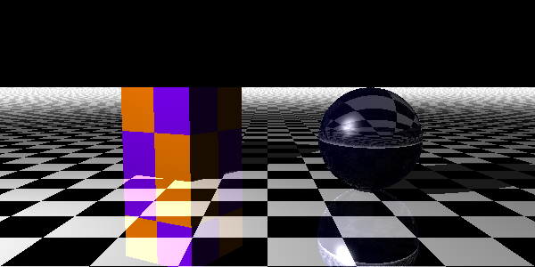
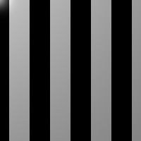
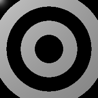
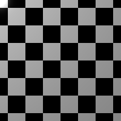
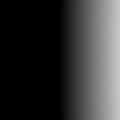

# scintilla

### Purpose

This is a fully featured ray tracer written in Clojure, based on the wonderful book by Jamis Buck, [The Ray Tracer Challenge](https://pragprog.com/book/jbtracer/the-ray-tracer-challenge). This is still a work in progress, so keep watching this space!

### Project goals

I've been wanting to write a ray tracer for _years_ but every single time I looked for any resources on writing one, they were always either too advanced or based on C or C++... and I am a _lousy_ C programmer. So, when I got an email from PragProg announcing the newly available beta release of a book on ray tracing, I instantaneously clicked on the link. And after thumbing through the table of contents and a sample chapter, it was clear that this the first book actually targeting people like me that have not yet built a system as complex s this. 

The book only supplies tests which you need to get to pass, and only pseudocode or code fragments as implementations; the rest is up to you. I chose Clojure, since it's the programming language that I'm most comfortable with and in the event I needed libraries, I had the JVM and the whole Java ecosystem at my disposal.

However, it turned out that the book actually shows you how to build _everything_ from the ground up, from being able perform matrix and vector arithmetic to generating an image file in `.ppm` format. And so I decided that these would be my goals for this project:

* Make the code mutation free and purely functional as possible
* Use raw data structures instead of Java objects or Clojure `defrecord`s
* Implement everything and not bring in any external libraries
* Focus on making the code as readable as possible, not caring about performance
* Putting in as many docstrings and comments as possible
* Keep things as simple as possible.

Regarding simplicity, most of the "objects" in this project are either Clojure vectors or merely hashmaps, with keywords as keys. Moreover, options for all of the object constructors are supplied as simple hashmaps with keyword keys. Restricting myself to data types native to Clojure made it much simpler to experiment and evolve the codebase. I must admit that there were times that I _did_ wish I had types that the compiler could have checked rather than simply getting cryptic errors or unexpected results at runtime.

### Usage

So... if you wanna jump right in and see a realtively robust code sample and its result, you could start up a REPL (with `lein repl`) and copy/paste the following:

```clj
(require '[scintilla.camera :as c])
(require '[scintilla.lighting :as l])
(require '[scintilla.materials :as a])
(require '[scintilla.matrix :as m])
(require '[scintilla.numeric :refer :all])
(require '[scintilla.patterns :as p])
(require '[scintilla.rendering :as r])
(require '[scintilla.scene :as e])
(require '[scintilla.shapes :as s])
(require '[scintilla.transformation :as t])

(let [;; Set up the cube
      left-position  (m/matrix-times
                        (t/translation-matrix -2 1 1)
                        (t/rotation-y-matrix π⟋6))
      left-pattern   (p/make-checker-pattern [1 0.5 0]
                                             [0.5 0 1]
                                             (t/scaling-matrix 2 2 2))
      left-material  (a/make-material {:pattern left-pattern
                                       :specular 0.9
                                       :shininess 50})
      left-shape     (s/make-cube {:material left-material
                                   :transform left-position})

      ;; Set up the sphere
      right-position (m/matrix-times
                      (t/translation-matrix 2 1 -1)
                      (t/rotation-y-matrix π⟋4))
      right-material (a/make-material {:color [0 0 0.1]
                                       :reflective 0.9
                                       :refractive-index 1.5
                                       :specular 0.9
                                       :transparency 0.7
                                       :shininess 20})
      right-shape    (s/make-sphere {:material right-material
                                     :transform right-position})

      ;; Set up the floor
      floor-pattern  (p/make-checker-pattern [0 0 0] [1 1 1])
      floor-material (a/make-material {:pattern floor-pattern
                                       :reflective 1.0
                                       :shininess 50
                                       :specular 0.9})
      floor          (s/make-plane {:material floor-material})

      ;; Assemble the entire scene
      light          (l/make-light [-5 5 -5 1] [1 1 1])
      scene          (e/make-scene [left-shape right-shape floor] light)

      ;; Set up the camera
      view-transform (t/view-transform-matrix-for [0 2 -10 1]
                                                  [0 1 0 1]
                                                  [0 1 0 0])
      camera         (c/make-camera 600 300 π⟋3 view-transform)]

  ;; Render the scene!
  (r/render-to-file camera scene "example.ppm")))
```

You should see a file generated at the root of the project directory, after about a minute or so, and it should look something like this:



There's a lot of stuff going on up there! Different shape types, patterns, colors, materials, a light, a camera, etc. If you already have played with something like [POV-Ray](http://www.povray.org), another ray tracer which has a scene description language, you could probably just dive into the code and play! If you haven't, it would probably help to read the sections below which describe all of the components of this implementation from the bottom up. We'll start with raw mathematical data structures.

#### Vectors, points, rays, and matrices

Vectors and points are merely Clojure vectors of length 4, with the fourth component differentiating the two types. `[1 2 3 1]` is the point (1, 2, 3) and `[1 2 3 0]` is the vector 𝒊 + 2𝒋 + 3𝒌.

Rays are hashmaps with keys `:point` and `:direction`, and can be made with the `scintilla.ray/make-ray` function. To make a ray that starts at the origin and points to (-1, 3, -5), just call:

```clj
(require '[scintilla.ray :as r])

(r/make-ray [0 0 0 1] [-1 3 -5 0])
```

You will not need them to just create and render scenes but methods for manipulating points and vectors are defined in `scintilla.tuple`, and for rays in `scintilla.ray`.

Matrices (2-dimensional ones, that is) are implemented merely as a vector of vectors. There aren't any convenience methods for creating matrices, but all of the common matrix manipulation functions are in `scintilla.matrix`. So, if you wanted to multiply two matrices, you could do the following:

```clj
(require '[scintilla.matrix :as m])

(def some-matrix [[1 2 3 4]
                  [2 3 4 5]
                  [3 4 5 6]
                  [4 5 6 7]])
(def another-matrix [[1 1 1 1]
                     [2 2 2 2]
                     [3 3 3 3]
                     [4 4 4 4]])

(m/matrix-times some-matrix another-matrix)
```

#### Colors

Colors are represented internally by 3-vectors of positive floats, where they represent the red, green, and blue components, in that order. The expected range of each value is [0.0, 1.0]; values that fall outside that range are eventually "clamped" when rendered. So, red would be `[1 0 0]` and purple would be `[0.5 0 1]`.

As with points and vectors, you will not need to maniplute colors, but if you are curious you can look in `scintilla.color`.

#### Shapes

Shapes are all defined in `scintilla.shapes`; there are five different primitive shapes implemented in this ray tracer. The table below lists them as well as eac of their default attributes:

| Shape | Defaults |
|---|---|
| Sphere | radius: 1 |
| Cube | length: 2 |
| Plane | lies in xz-plane |
| Cylinder | radius: 1 <br> main axis: y <br> minimum y-value: -∞ <br> maximum y-value: ∞ <br> capped?: false |
| Cone | main axis: y <br> minimum y-value: -∞ <br> maximum y-value: ∞ <br> capped?: false |

For example, you can create a new sphere, set at the origin with all other default attributes, by simply typing:

```clj
(require '[scintilla.shapes :as s])

(s/make-sphere)
```

By default, _all_ shapes are centered at the origin, and different shape types can have different properties and default values for them.

Currently there are two attributes that are shared across all shapes:

* `:material` - the hashmap that describes various optical properties of the shape
* `:transform` - the matrix that describes how a shape is moved or altered

Cones and cylinders are slightly more complicated than the other three and have these additional properties:

* `:minimum` - the y value of correspondent with the bottom of the shape
* `:maximum` - the y value of correspondent with the top of the shape
* `:capped?` - set to `true` if the ends are closed or `false` if open

#### Materials

Materials are used to describe the all of the optical properties of a shape. The following attributes are currently supported:

* `:ambient` - a value from 0.0 to 1.0 which controls the proportion of the object's color used in its shadowed portions. The default value is 0.1.
* `:color` - the actual color of the shape if a pattern is not specified. The default value is `[1 1 1]`.
* `:diffuse` - a value from 0.0 to 1.0 which controls how matte-like the surface of the shape should be from a direct light source. The default value is 0.9.
* `:pattern` - the pattern associated with the shape whose implementation computes the color. There is no default pattern and instead the color value is used if no pattern is specified.
* `:reflective` - a value from 0.0 to 1.0 which controls how reflective a shape is from light _from other objects_. The default value is 0.0.
* `:refractive-index` - a value greater than or equal to 1.0 which effectively controls how a light ray bends when it moves from one medium into another. The default value is 1.0.
* `:shininess` -  a unbounded positive value that controls the size of the specular highlight on a shape. The default value is 200.
* `:specular` - a value from 0.0 to 1.0 which controls the proportion of light from a direct light source that reflects off of a point on the surface of the shape should contribute to the overall color. The default value is 0.9.
* `:transparency` - a value from 0.0 to 1.0 which controls the proportion of light from that passes through a point on the surface of a shape. The default value is 0.0.

It should be noted that this ray tracer employs a form of the Phong reflection algorithm for modeling how light from a direct source reflects off of surfaces; the `:ambient`, `:diffuse`, `:specular`, and `:shininess` properties specifically parameterize this effect. You can read more about this algorithm in this excellent [Wikipedia page](https://en.wikipedia.org/wiki/Phong_reflection_model).

As an example of using a material, to create a purple sphere, you must first create a material with that color, and then associate that material with the sphere, as in the following: 

```clj
(require '[scintilla.materials :as a])
(require '[scintilla.shapes :as s])

(def purple-material
  (a/make-material {:color [0.5 0.0 1.0]}))

(s/make-sphere {:material purple-material})
```

Unspecified options for a material will be set to their default values as listed above.

#### Transforms 

There are four different classes of transformations that can be applied to three dimensional shapes; they are all implemented in `scintilla.transformation`:

* Scaling - there is just one function, `scaling-matrix`, which takes three parameters to govern how to scale along each of the x, y, and z axes.
* Translation - there is just one function, `translation-matrix`, which also takes three parameters to govern how to scale along each of the x, y, and z axes
* Rotation - there are _three_ functions, `rotation-x-matrix`, `rotation-y-matrix`, and `rotation-z-matrix`, that each take a single parameter in radians
* Shearing - there is one function, `shearing-matrix`, that takes six parameters governing each of the possible shearing ratios.

Each of these function types produces a 4x4 matrix; you can read more about these so-called affine transformation matrices [here](https://www.mathworks.com/help/images/matrix-representation-of-geometric-transformations.html#bvnhvau).

As a simple example, to make an egg-shaped object, you could do the following:

```clj
(require '[scintilla.transformation :as t])
(require '[scintilla.shapes :as s])

(def deform-into-egg
  (t/scaling-matrix 1 0.5 0.5))

(s/make-sphere {:transform deform-into-egg})
```

You can also combine transformations right to left using `scintilla.matrix/matrix-times`. To deform, rotate, then move the same egg shape as before, you could do the following:

```clj
(require '[scintilla.matrix :as m])
(require '[scintilla.transformation :as t])
(require '[scintilla.shapes :as s])

(def combined-transform
  (m/matrix-times
    (t/translation-matrix 
    (t/rotate-z-matrix π⟋4)
    (t/scaling-matrix 1 0.5 0.5))

(s/make-sphere {:transform combined-transform})
```

#### Patterns

There are four pattern types implemented in `scintilla.patterns`, and each of them takes two color parameters:

* Stripes - `make-stripe-pattern`



* Rings - `make-ring-pattern`



* Checkered - `make-checker-pattern`



* Linear gradient - `make-gradient-pattern`



Here's an example of a cube with a red and green checkered pattern: 

```clj
(require '[scintilla.matrix :as m])
(require '[scintilla.patterns :as p])
(require '[scintilla.shapes :as s])

(def red-and-green-checkers
  (a/make-material {:pattern (p/make-pattern [1 0 0] [0 1 0])}))

(s/make-cube {:material red-and-green-checkers})
```


#### Groups

```
(make-group [...] transform)
```

#### Light

```
(make-light ...)
```

#### Scene

#### Camera

#### Rendering

### Future goals

Use libraries with support for BLAS or GPUs for improved performance
Take a drive with a differnt PL

### Important links

* The Ray Tracer Challenge listing on the PragProg site.  
  [https://pragprog.com/book/jbtracer/the-ray-tracer-challenge](https://pragprog.com/book/jbtracer/the-ray-tracer-challenge)  
* POV-Ray  
  [https://www.povray.org](https://www.povray.org)
* 3D affine transformation matrices  
  [https://www.mathworks.com/help/images/matrix-representation-of-geometric-transformations.html#bvnhvau](https://www.mathworks.com/help/images/matrix-representation-of-geometric-transformations.html#bvnhvau)
* Wikipedia page on the Phong reflection model  
  [https://en.wikipedia.org/wiki/Phong_reflection_model](https://en.wikipedia.org/wiki/Phong_reflection_model)  
* 

### License
Copyright (C) 2019, ⅅ₳ℕⅈⅇℒℒⅇ Ҝⅇℱℱoℜⅆ.

Distributed under the Eclipse Public License either version 1.0 or (at your option) any later version.